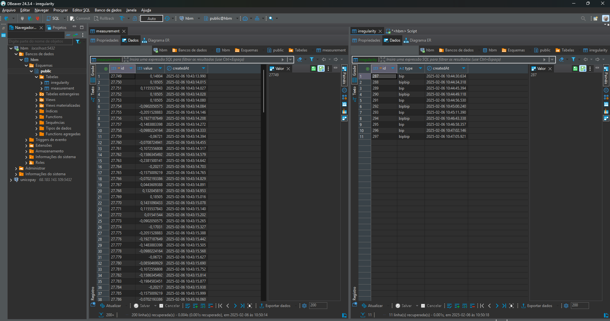
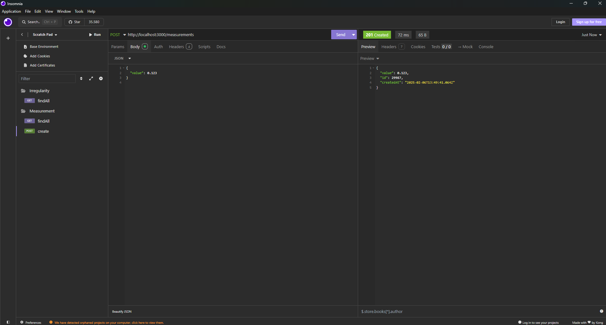
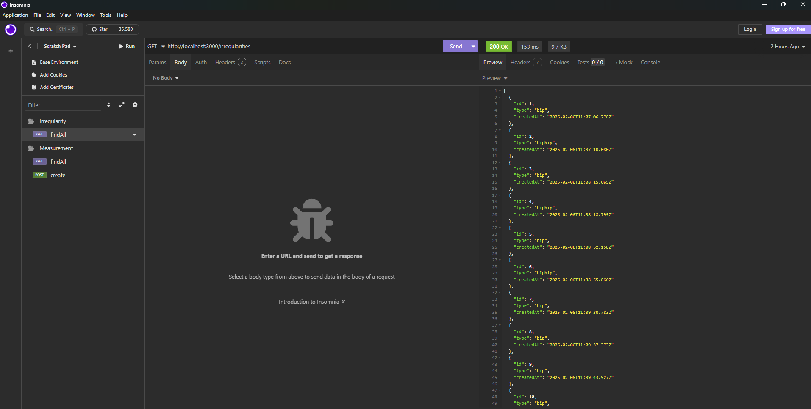
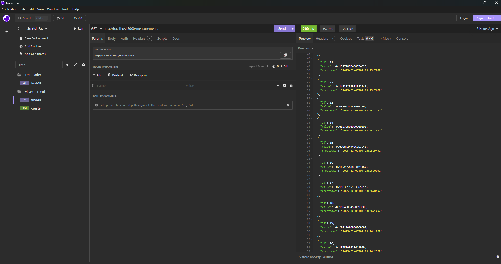

# hbm-plus

Projeto que simula medições e verifica irregularidades, disparando alertas de forma automatizada.

## Demonstração da Aplicação

### GIF de Funcionamento


### Prints

#### Print do Database



#### createMeasurement



#### findAllIrregularity



#### findAllMeasurement



## Tecnologias utilizadas

- [Nest.js](https://github.com/nestjs/nest)
- [TypeORM](https://typeorm.io/)
- [PostgreSQL](https://www.postgresql.org/)
- [Axios](https://axios-http.com/ptbr/docs/intro)
- [Jest](https://jestjs.io/pt-BR/)
- [TypeScript](https://www.typescriptlang.org/)
- [Insomnia](https://insomnia.rest/)

## Como rodar o projeto

### Pré-requisitos

- Node.js (versão recomendada: >=14)
- Yarn ou npm
- PostgreSQL

### Configurando o banco de dados

Conecte-se ao PostgreSQL e execute os comandos abaixo para criar o banco e o usuário:

```sql
CREATE DATABASE hbm;
CREATE USER admin WITH PASSWORD 'admin';
GRANT ALL PRIVILEGES ON DATABASE hbm TO admin;
```

### Variáveis de ambiente

Crie um arquivo .env na raiz do projeto com o seguinte conteúdo:

```.env
DATABASE_HOST=localhost
DATABASE_PORT=5432
DATABASE_USER=admin
DATABASE_PASS=admin
DATABASE_NAME=hbm
```

### Instalação

Instale as dependências com:

```bash
$ yarn install
```

ou

```bash
$ npm install
```

### Rodando o projeto

Para iniciar o servidor em modo desenvolvimento:

```bash
$ yarn start:dev
```

### Testando o simulador

O projeto inclui um simulador para envio de medições, que pode ser iniciado com:

```bash
$ yarn simulator
```

### Rodando testes unitários

Para executar os testes unitários:

```bash
$ yarn test
```

## Testar funcionalidade de gerar sinais e criar as medições

Para isso de rodar o comando para iniciar o servidor:

```bash
$ yarn start:dev
```

E em paralelo rodar o comando para iniciar o simulador:

```bash
$ yarn simulator
```

## License

Nest is [MIT licensed](https://github.com/nestjs/nest/blob/master/LICENSE).
